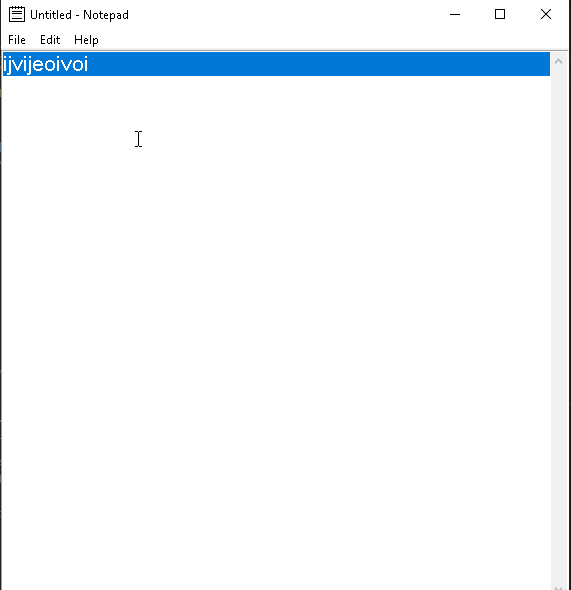

# Notepad-Python_Tkinter
Created a GUI Based notepad using Python Tkinter and has some basic functions..

**Notepad** is a python app that allows creating a notepad and basic notepad management functionality including opening New files, Editing, Help, Exit, having a scroll bar and Saving a file.

Submitted by: **Devansh Goel**

Time spent: **5** hours spent in total

## User Stories

The following **required** functionality is completed:

* [x] User can **Create a new file**
* [x] User can **Open a new a file**
* [x] User can **Copy, Cut and Paste the File** 
* [x] User can **Edit, Exit and Save the File**  

## Video Walkthrough

Here's a walkthrough of implemented user stories:

GIF created with [LiceCap](http://www.cockos.com/licecap/).

## Notes

It is better to use the Photomap Library to import images in the GUI program.

## License

    Copyright [2021] [Devansh]

    Licensed under the Apache License, Version 2.0 (the "License");
    you may not use this file except in compliance with the License.
    You may obtain a copy of the License at

        http://www.apache.org/licenses/LICENSE-2.0

    Unless required by applicable law or agreed to in writing, software
    distributed under the License is distributed on an "AS IS" BASIS,
    WITHOUT WARRANTIES OR CONDITIONS OF ANY KIND, either express or implied.
    See the License for the specific language governing permissions and
    limitations under the License.
